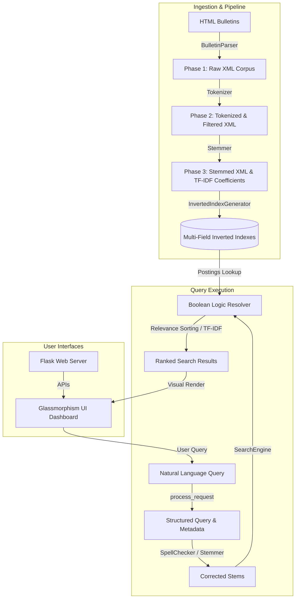

# PySearchNLP: Natural Language Search Engine & NLP Suite

PySearchNLP is a custom-engineered, end-to-end information retrieval and natural language processing (NLP) engine built from the ground up in Python. Designed to run on structured French newsletter corpora (ADIT bulletins), it demonstrates capabilities in lexical tokenization, semantic metadata extraction, orthographic spelling correction, binary search tree metadata indexing, inverted indexing with TF-IDF scoring, and boolean expression resolution.

The project features a sleek, premium **Glassmorphism Web Dashboard** showing real-time query pipeline stages, inverted index posting lists, and general corpus statistics.

> [!NOTE]
> **Database Language Notice:** Since the database (ADIT bulletins corpus) is entirely in French, all search results and matching documents are returned in French.

---

## Key Features
*   **Custom NLP Processing Pipeline**: Tokenization patterns, noise (stopword) filtering, and NLTK Snowball stemming.
*   **Multi-Field Inverted Indexing**: Separate title, content, author, category (rubric), date, and image indexes built from scratch using hash maps and balanced binary trees.
*   **Lexicon-Based Spell Checker**: Custom distance metric calculation using Levenshtein distance to automatically suggest vocabulary matches.
*   **Linguistic Metadata Extraction**: Semantic parsing of natural language queries to extract dates, categories, images, titles, and resolve boolean logic (`AND`, `OR`, `AND_NOT`).
*   **Corpus Analytics Dashboard**: Web-based analytical charts visualizing vocabulary stem frequencies and document distribution.
*   **Interactive Index Inspector**: Debugging tool to inspect structural posting lists and postings count for any term or metadata property directly from the browser.

---

## System Architecture

The following diagram illustrates the lifecycle of document ingestion, indexing, and query evaluation:



---

## Indexing & Search Algorithms

### 1. Document Parsing & Tokenization
The parser loads raw `.htm` bulletins, normalizes HTML formatting anomalies, and structures documents into XML containing fields: `title`, `text`, `date`, `rubric`, `author`, `contact`, and `images`.
The custom tokenizer splits streams using a highly selective regular expression:
$$\text{Regex: } \backslash b\backslash w\{3,\}[']\backslash w+\backslash b \quad | \quad \backslash b\backslash w+(?:-\backslash w+)+\backslash b \quad | \quad \backslash b\backslash w+\backslash b$$
This pattern properly preserves French apostrophes (e.g., *d'innovation*) and hyphens while ignoring individual punctuation characters. Words matching the stopword list are filtered out to reduce noise.

### 2. Stemming & Vocabulary Compilation
Using the NLTK Snowball French stemmer, all vocabulary words are mapped to their roots (e.g., *recherche* and *recherches* to *recherch*). An aggregate vocabulary lexicon is exported to map each word to its corresponding stem, serving as the dictionary base for spelling suggestions.

### 3. Balanced Binary Search Trees (BST)
To perform instantaneous metadata filtering (by category/rubric, publication date, or author), PySearchNLP indexes these fields using a custom Balanced Binary Search Tree (`BinarySearchTree`). The BST is constructed by sorting metadata keys alphabetically and building the tree recursively from the median:
```python
def build_balanced(self, sorted_items):
    if not sorted_items:
        return None
    mid = len(sorted_items) // 2
    node = Node(sorted_items[mid][0], sorted_items[mid][1])
    node.left = self.build_balanced(sorted_items[:mid])
    node.right = self.build_balanced(sorted_items[mid+1:])
    return node
```
This guarantees $O(\log N)$ search times for structural constraints.

### 4. TF-IDF Weighting Model
For unstructured query matching, document postings lists are scored using the classic Term Frequency-Inverse Document Frequency (TF-IDF) formulation:

$$\text{TF}(t, d) = \text{frequency of term } t \text{ in document } d$$
$$\text{IDF}(t, D) = \log \left( \frac{|D|}{|\{d \in D : t \in d\}|} \right)$$
$$\text{Score}(q, d) = \sum_{t \in q} \text{TF}(t, d) \times \text{IDF}(t, D)$$

---

## Installation & Setup

### Requirements
*   Python 3.10+
*   Dependencies listed in [requirements.txt](file:///c:/Users/iagor/Documents/Iago/Códigos/Search_Engine/requirements.txt) or [pyproject.toml](file:///c:/Users/iagor/Documents/Iago/Códigos/Search_Engine/pyproject.toml)

### Virtual Environment Configuration (Recommended)
```bash
# Create a virtual environment
python -m venv .venv

# Activate the virtual environment
# Windows PowerShell:
.venv\Scripts\Activate.ps1
# Linux/macOS:
source .venv/bin/activate

# Install dependencies
pip install -r requirements.txt
```

### Conda Environment Configuration (Alternative)
```bash
conda env create -f environment.yml
conda activate pysearchnlp
```

---

## Running the Engine

### 1. Bootstrapping the Indexing Pipeline
Run the Flask server to parse the HTML bulletins and build the search engine indexes automatically:
```bash
python src/web/app.py
```
On startup, the system checks for existing indexes. If they are absent, it executes the multi-phase pipeline in a background thread and boots up the server.

### 2. Accessing the Web Dashboard
Open your browser and navigate to:
```
http://localhost:5000
```
Here you can test search queries, inspect the inverted indexes, and check corpus stats.

---

## Verification & Tests

### Automated Unit Tests
To run the project unit test suite (covering tokenization, Levenshtein distance, spell checking, and metadata parsing):
```bash
python -m pytest tests/
```

### System Smoke Check
To run a full check on project requirements, output paths, and search capabilities:
```bash
python src/check_system.py
```

### Performance & Accuracy Evaluation
To evaluate search engine accuracy, precision, and response times on the validation set of 10 structural and semantic queries:
```bash
python src/evaluation.py --runs 100 --inspect --top 50
```
This runs 1,000 queries in total (100 timed runs per query) and generates precision, recall, and latency metrics:
*   **CSV Output**: [evaluation_results.csv](file:///c:/Users/iagor/Documents/Iago/Códigos/Search_Engine/data/outputs/evaluation/evaluation_results.csv)
*   **JSON Output**: [evaluation_results.json](file:///c:/Users/iagor/Documents/Iago/Códigos/Search_Engine/data/outputs/evaluation/evaluation_results.json)
*   **Performance Charts**: Saved as PNG charts in the evaluation output folder:
    *   [precision.png](file:///c:/Users/iagor/Documents/Iago/Códigos/Search_Engine/data/outputs/evaluation/precision.png) (accuracy per query)
    *   [recall.png](file:///c:/Users/iagor/Documents/Iago/Códigos/Search_Engine/data/outputs/evaluation/recall.png) (coverage per query)
    *   [response_time.png](file:///c:/Users/iagor/Documents/Iago/Códigos/Search_Engine/data/outputs/evaluation/response_time.png) (retrieval latency in ms)

#### Pre-Computed Validation Results

Below are the pre-computed accuracy (precision and recall) and response time latency results evaluated against the objective ground truth over 100 timed runs:

| Query ID | Validation Query Text | Precision | Recall | Avg Latency | Returned Docs |
|----------|-----------------------|-----------|--------|-------------|---------------|
| 1 | Je veux les articles de la rubrique Focus parlant d'innovation. | 100% | 100% | 2.193 ms | 42 |
| 2 | Afficher les articles de la rubrique en direct des laboratoires. | 100% | 100% | 0.913 ms | 40 |
| 3 | Je voudrais les articles de 2011 sur l'enseignement. | 100% | 100% | 0.409 ms | 10 |
| 4 | Quels sont les articles parlant de la Russie ou du Japon ? | 100% | 100% | 1.310 ms | 26 |
| 5 | Liste des articles qui parlent soit du CNRS, soit des grandes écoles, mais pas de Centrale Paris. | 100% | 100% | 6.153 ms | 102 |
| 6 | Articles contenant une image. | 100% | 100% | 3.935 ms | 113 |
| 7 | Je veux les articles sans image. | 100% | 100% | 5.419 ms | 213 |
| 8 | Je voudrais les articles dont le titre contient le mot chimie. | 100% | 100% | 0.038 ms | 3 |
| 9 | Quels sont les articles parus entre le 3 mars 2013 et le 4 mai 2013 évoquant les Etats-Unis ? | N/A | N/A | 0.069 ms | 0 |
| 10 | Je veux les articles qui parlent des systèmes embarqués et non pas la robotique. | 100% | 100% | 0.310 ms | 7 |

*Note: Query 9 has no relevant documents matching its constraints in the corpus, so precision and recall are not applicable (N/A).*

---

## Supported Query Semantics
The query processor extracts rich metadata constraints from natural language text:
*   **Rubric filters**: `"Je veux les articles de la rubrique Focus..."` (maps search to `Focus` category)
*   **Year and Range dates**: `"articles de 2011"`, `"articles parus entre le 3 mars 2013 et le 4 mai 2013"`
*   **Image constraints**: `"articles sans image"`, `"articles contenant une image"`
*   **Field targeted lookup**: `"les articles dont le titre contient le mot chimie"`
*   **Boolean operators**: `"soit le CNRS, soit des grandes écoles, mais pas de Centrale Paris"` (translates to logical `OR` and `AND_NOT` expressions)

---

## Project Structure
```
pysearchnlp/
├── .github/workflows/   # Github Actions CI pipeline configuration
├── data/
│   ├── BULLETINS/       # Source HTM articles (ADIT corpus)
│   └── outputs/         # Processed and cached indexes
│       ├── phase_1_xml/ # Consolidated raw corpus XML
│       ├── phase_2_tokenized/ # Stopwords-filtered tokenized XML
│       ├── phase_3_indexed/   # Stem listings, BST maps, TF-IDF weights, postings lists
│       └── evaluation/  # Precision/recall ground truths and metrics
├── src/
│   ├── web/             # Flask entrypoint, HSL glassmorphism HTML/CSS/JS files
│   ├── search_engine.py # Binary Search Tree & main index retrieval engines
│   ├── query_processing.py # Natural language semantic analyzer & boolean grammar resolver
│   ├── tokenizer.py     # French corpus word tokenizer
│   ├── stemmer.py       # Snowball stem mapper
│   ├── spell_checker.py # Levenshtein approximate matching searcher
│   └── evaluation.py    # Timed metrics evaluation run script
└── tests/               # Pytest assertions suite
```

---

## License
This project is licensed under the MIT License - see the project metadata details.
